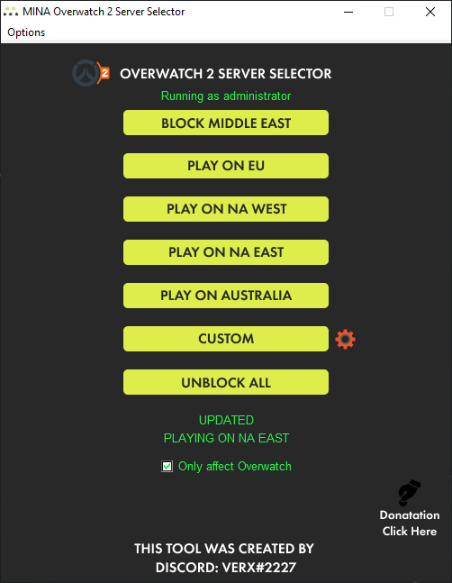

# MINA Overwatch 2 Server Selector

	

A simple application that allows you to select the servers you want to play on!

## General Information
### Setup Download
- Download link in the Assets of [the latest release](https://github.com/foryVERX/Overwatch-Server-Selector/releases/latest).

### Portable Download
- To download the bleeding edge build of this application, built automatically by GitHub, head over to [Actions](https://github.com/foryVERX/Overwatch-Server-Selector/actions/), select the latest build with a green check mark, scroll down to the artifacts section. There is your download.

### Converting python files to exe (optional)
- If you want to convert the files to exe yourself without using my provided download, see the [Build section](#build) for a guide to do so. Requires you to have some previous experience with Python. 

## Introduction

The application simply works by blocking Overwatch 2 IP addresses using wf.msc (Firewall with Advance Security). To do this, the application needs to run as administrator. It uses Component Object Model (COM) API to directly add/remove the blocking rules. **The application does not read or write on game files or modify the network traffic of the game!**

As long as you have a standard firewall (Windows Firewall) and antivirus (Microsoft Defender Antivirus), no further action to make the application work is necessary.

There are predefined buttons to block the server regions AU, EU, ME, NA-West, and NA-East. You can also use the "Custom" button to selectively block regions/servers.

The Overwatch 2 matchmaker will test to find the best server with the best ping. When you block a server in the firewall, the specified server will be inaccessible and get ranked lowest amongst the server. The server with the lowest ping will be selected and used to find you a game.

The block ME option can help in a situation where some times the matchmaker puts you in a bad server, for example if your best is EU, it gets you to ME one game out of 100.

EU players can, with this application, now play on NA servers. The problem is that even if you change the Battle.net region to America, it gives you an European Overwatch 2 server. The server selector enables you pick the region to play on whether its NA East or NA West. It then blocks the connection to all other regions than NA West/East.

NA players are also able to specify whether they prefer to play on NA East or NA West.

# MINA OVERWATCH 2 SERVER SELECTOR V5.0

* Supports
	* Play on EU
	* Play on NA West
	* Play on NA East
	* Play on Australia
* Updated servers to work on Overwatch 2
* Custom config option, alows you to create your cutom settings.
* An option that only affect overwatch when blocked
*  Added donation button for support ;)

Please reach out if you want to help or have a question, discord: VERX#2227

**The application has to be ran as administrator to be able to add or remove firewall rules.**

## Requirements
### Video Guide
[HOW TO USE MINA OVERWATCH 2 SERVER](https://youtu.be/ySLK0wW3lDc)

Note: when applying options take care about this

If you apply options while the game is running:

	FROM NO OPTION CHOSEN TO PLAY ON OPTION 	--->  GAME RESTART REQUIRED
	FROM PLAY ON OPTION TO UNBLOCK ALL	 	--->  NO RESTART REQUIRED

## Download
[DOWNLOAD MINA OVERWATCH 2 SERVER SELECTOR](https://github.com/foryVERX/Overwatch-Server-Selector/releases)

# Build 

## Pyinstaller
To manually build the application
1. Install latest Python
2. `pip install pyinstaller`
3. To build the exe, simply run this in the repository :`pyinstaller Overwatch-Server-Selector.exe.spec`
4. The exe is now located in `dist\Overwatch-Server-Selector.exe`

## Auto py to exe users

If you want to convert py to exe follow the guide.

note you need to know what are you doing if you are here 😉.

1. Install latest Python
2. `pip install auto-py-to-exe`
3. In terminal `auto-py-to-exe`.
4. Script Location use main.py where ever you locate it.
5. Choose onefile.
6. Choose Window based(hide console)
7. Icon choose icon provided in .img folder.
8. Additional File (very important), to include `pic2str.py` which have all the images used in byte format.
9. In advance make sure you do the following:
	*   `-name Overwatch Server Selector`
	* `--uac admin: Enable`
11. CONVERT .PY TO .EXE
12. The exe is now located in `output\Overwatch Server Selector.exe`

# Manually Install IP List
It should be odd when this happens, but this is usefull when having the following issues such as.

1. Not able to update the app.
2. IP List is not installing.
3. It says working on it and stuck.
4. Shows no internet connection while you have internet.

### How to
1. [Download the project from this link](https://github.com/foryVERX/Overwatch-Server-Selector/archive/refs/heads/main.zip)
2. Unzip and copy the content of ip_list folder.
3. Open the app installed at your system navigate to OPTIONS.
4. Press on open config folder.
5. Paste content of ip_list.
6. Restart the app.
7. 
Note. For each ip list update you have to update manually if it doesn't work again.

